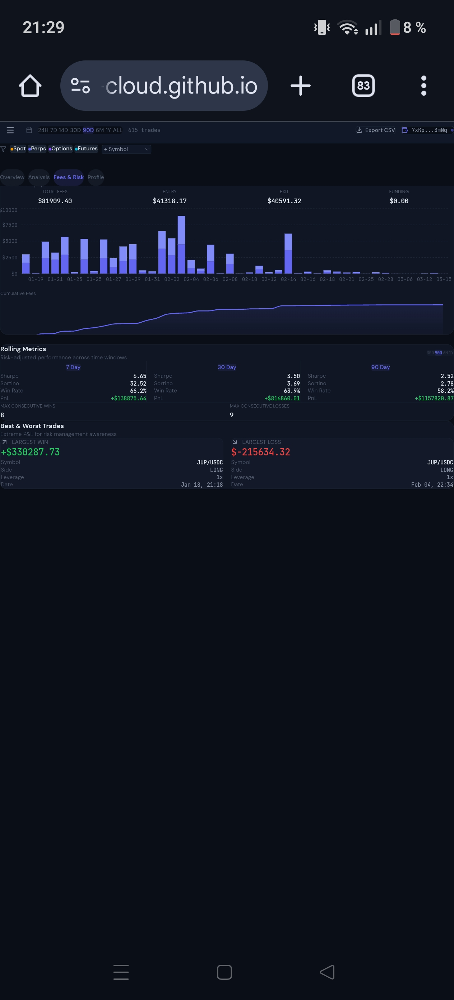
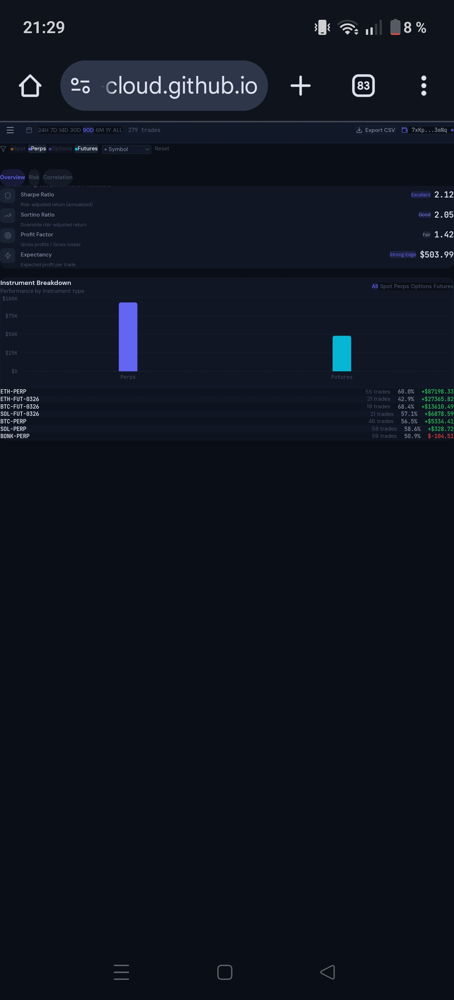
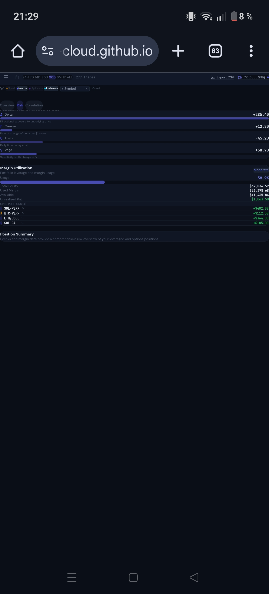
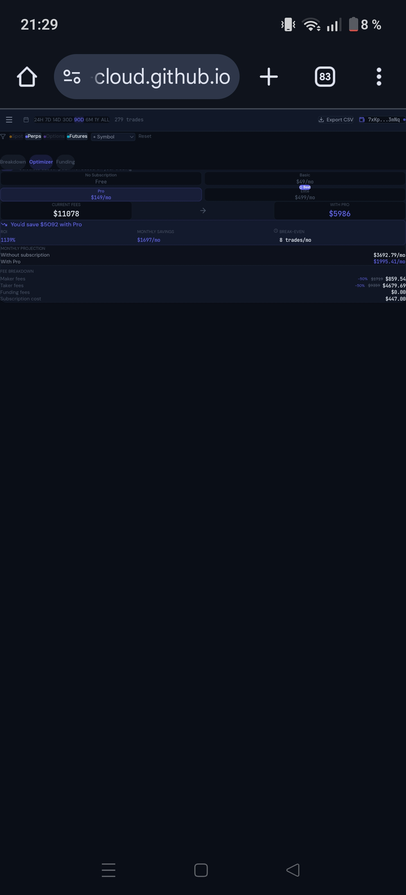

# Deriverse Trading Analytics

**Professional trading journal and portfolio analysis for active Deriverse traders.**

[](https://www.typescriptlang.org/)
[](https://react.dev/)
[](https://tailwindcss.com/)
[](LICENSE)

> Institutional-grade analytics dashboard featuring 28+ metrics, intelligent trade journaling, and Deriverse-specific fee optimization — built for serious derivatives traders on Solana.

---

## Screenshots

<div align="center">

| Dashboard Overview | Analysis & Heatmap | Fees & Rolling Metrics |
|:---:|:---:|:---:|
|  |  |  |

| Trade History | Portfolio Metrics | Risk & Greeks |
|:---:|:---:|:---:|
|  |  |  |

| Fee Optimizer | Trader Profile | Smart Insights |
|:---:|:---:|:---:|
|  |  |  |

</div>

> 📱 Mobile-first responsive design — optimized for both mobile and desktop trading.

## Highlights

A dark-first trading analytics platform designed with the institutional terminal aesthetic that professional traders expect. Every number displays in monospace font for perfect alignment. Profit/loss indicators use consistent green/red signaling throughout. The dashboard covers all four Deriverse instrument types: Spot, Perpetual Futures, Options, and Futures.

**Key differentiators:**
- Risk-adjusted metrics (Sharpe, Sortino, Profit Factor, Expectancy)
- Intelligent trade journal with emotion-performance correlation
- Deriverse fee subscription optimizer showing real ROI
- Funding rate PnL separation for perpetuals
- Hour-by-day performance heatmap for session analysis
- Full portfolio Greeks exposure tracking

---

## Features

### Core Analytics (13/13 Requirements)

| # | Requirement | Implementation | Component |
|---|------------|----------------|-----------|
| 1 | Total PnL with visual indicators | Count-up animation, sparkline, green/red coloring, percentage change | `PnLCard.tsx` |
| 2 | Trading volume and fee analysis | Stacked bar chart by fee type, cumulative line chart | `FeeAnalysis.tsx` |
| 3 | Win rate and trade count | Circular metric cards with win/loss breakdown | `StatsGrid.tsx` |
| 4 | Average trade duration | Formatted as Xh Ym with trend indicator | `StatsGrid.tsx` |
| 5 | Long/Short ratio and directional bias | Donut chart with PnL and win rate per direction | `DirectionalBias.tsx` |
| 6 | Largest gain/loss for risk management | Side-by-side cards with full trade details | `BestWorstTrades.tsx` |
| 7 | Average win/loss amounts | Metric cards with profit factor context | `StatsGrid.tsx` |
| 8 | Filter by symbol and date range | Global period selector (7D/30D/90D), instrument toggles, symbol picker | `FilterBar.tsx` + `Header.tsx` |
| 9 | Historical PnL with drawdown visualization | Equity curve with toggleable drawdown overlay | `EquityCurve.tsx` |
| 10 | Time-based performance metrics | Hour-by-day PnL heatmap with UTC sessions | `PerformanceHeatmap.tsx` |
| 11 | Trade history with annotation capabilities | Sortable/filterable table, inline expand, emotion/setup/grade tags | `TradeTable.tsx` |
| 12 | Fee breakdown showing cumulative fees | Entry/exit/funding stacked bars + running total | `FeeAnalysis.tsx` |
| 13 | Order type performance analysis | Market/Limit/Stop/Stop-Limit comparison with PnL and win rate | `OrderTypeAnalysis.tsx` |

### Institutional Metrics

| Metric | Formula | Category |
|--------|---------|----------|
| Sharpe Ratio | (mean daily return - Rf) / std dev * sqrt(252) | Risk-adjusted |
| Sortino Ratio | (mean daily return - Rf) / downside dev * sqrt(252) | Risk-adjusted |
| Profit Factor | Sum of wins / Sum of losses | Performance |
| Expectancy | (Win% x AvgWin) - (Loss% x AvgLoss) | Edge |
| Max Drawdown | Maximum peak-to-trough percentage decline | Risk |
| Rolling Windows | 7D/30D/90D Sharpe, Sortino, Win Rate, PnL | Trend |

### Intelligent Journal

- **Emotion Tagging:** Disciplined, FOMO, Revenge, Fearful, Greedy, Neutral — correlated with win rate
- **Setup Classification:** Breakout, Trend, Mean Reversion, Range, News — win rate per setup type
- **Execution Grading:** A/B/C/D quality independent of P&L outcome
- **Trade Notes:** Pre-trade thesis and post-trade review
- **Performance Analytics:** Emotion-performance, setup-performance, and grade-performance correlation panels

### Deriverse-Specific

- **Fee Subscription Optimizer:** Calculate ROI for Basic ($49/mo), Pro ($149/mo), and Enterprise ($499/mo) tiers showing exact savings based on your maker/taker volume
- **Funding Rate PnL Separation:** Split perpetual returns into trading PnL vs. funding cost — a metric specific to perps traders
- **Greeks Exposure:** Aggregate Delta, Gamma, Theta, Vega across options portfolio
- **Liquidation Proximity:** Visual distance-to-liquidation for leveraged positions
- **Margin Utilization:** Real-time margin usage with risk level classification

### Portfolio Analytics

- **Instrument Breakdown:** Spot/Perps/Options/Futures performance with per-symbol drill-down
- **Correlation Matrix:** Daily PnL correlation between top instruments
- **Open Positions:** Live unrealized PnL with leverage and liquidation price

---

## Quick Start

```bash
git clone https://github.com/mbarreiroaraujo-cloud/deriverse-analytics.git
cd deriverse-analytics
npm install
npm run dev
```

Open http://localhost:5173

The dashboard loads with realistic simulated data (600+ trades over 90 days) — no API keys or backend required.

---

## Architecture

### Tech Stack

| Layer | Technology | Why |
|-------|-----------|-----|
| Framework | React 19 + TypeScript 5.8 | Type safety, component ecosystem |
| Styling | Tailwind CSS 4 | Utility-first, dark mode, rapid iteration |
| Charts | Recharts | React-native composable charts |
| State | Zustand | Minimal boilerplate, performant selectors |
| Animations | Framer Motion | Declarative page transitions |
| Fonts | JetBrains Mono + Inter | Terminal aesthetic for numbers |
| Build | Vite 7 | Fast HMR, optimized production builds |

### Data Flow

```
Mock Generator (seeded PRNG)
    |
    v
Zustand Store (allTrades, filters, portfolio)
    |
    ├── Filters applied --> filteredTrades
    |
    v
Metrics Engine (calculateMetrics)
    |
    v
Components (dashboard, journal, portfolio, fees)
```

### Adapter Pattern

The data layer is designed with a clean adapter interface. Currently, `mockGenerator.ts` provides simulated data. When the Deriverse SDK becomes available, swapping the data source requires only implementing the adapter interface — no component changes needed.

```typescript
// Current: Mock data
const trades = generateTrades(42);

// Future: Deriverse SDK
const trades = await deriverse.getTradeHistory(wallet);
```

### Component Structure

```
src/
├── components/
│   ├── layout/          # Sidebar, Header, DashboardShell
│   ├── dashboard/       # PnL, Stats, Equity, Heatmap, Fees, Orders
│   ├── journal/         # TradeTable, EmotionTagger, SetupClassifier, Grader
│   ├── portfolio/       # Instruments, Risk, Greeks, Margin, Correlation
│   ├── deriverse/       # FeeSimulator, FundingPnL, LiquidationProximity
│   └── shared/          # MetricCard, MiniChart, FilterBar, ExportButton
├── data/                # Types, mock generator
├── engine/              # Metrics calculations
├── store/               # Zustand state management
└── pages/               # Page-level compositions
```

---

## Metrics Engine

All metrics are calculated in `src/engine/metrics.ts` with documented formulas:

| Metric | Formula | Notes |
|--------|---------|-------|
| Sharpe Ratio | (mu - Rf) / sigma * sqrt(252) | Annualized, daily returns, Rf = 5% annual |
| Sortino Ratio | (mu - Rf) / sigma_d * sqrt(252) | Only penalizes downside volatility |
| Profit Factor | sum(winning trades) / sum(abs(losing trades)) | >1.5 is good, >2.0 is excellent |
| Expectancy | (WR * AvgWin) - ((1-WR) * AvgLoss) | Expected profit per trade |
| Max Drawdown | max(peak - trough) / peak | Maximum percentage decline from equity peak |
| Win Rate | winning trades / total trades | Based on PnL > 0 |
| Long/Short Ratio | long trades / short trades | Directional bias indicator |

---

## Mock Data Engine

The mock data generator produces realistic trading data using a seeded PRNG for deterministic output:

- **600-720 trades** over a 90-day period
- **Fat-tailed PnL distribution** using Pareto (alpha=2.5) — many small trades, few large ones
- **Realistic win rate** targeting 58-62% (not the unrealistic 80%+ of generic demos)
- **Temporal clustering** around Asian (UTC 00-08) and US (UTC 13-21) sessions
- **Drawdown periods** — 2-3 multi-day losing streaks with recovery patterns
- **Instrument mix:** 40% spot, 35% perpetuals, 15% options, 10% futures
- **Leverage distribution:** 80% at 2-5x, 15% at 5-8x, 5% at 8-10x
- **Realistic fees:** Maker 0.02-0.05%, Taker 0.05-0.1%, variable funding rates
- **Journal data** pre-populated on ~30% of trades to demonstrate the feature
- **Solana DEX symbols:** SOL/USDC, BTC/USDC, ETH/USDC, BONK/USDC, SOL-PERP, BTC-PERP, etc.

---

## Design Philosophy

### Why "Institutional Terminal"

Professional trading tools are dark, information-dense, and use monospace fonts for numeric alignment. This dashboard follows Bloomberg Terminal design principles adapted for modern web:

- **Dark-first:** `#0b0f19` background — near-black blue, not pure black
- **Typography:** JetBrains Mono for all numbers and metrics, Inter for body text
- **Trading signals:** Green (#22c55e) for profit, Red (#ef4444) for loss — no ambiguity
- **Instrument colors:** Amber (Spot), Indigo (Perps), Purple (Options), Cyan (Futures)
- **Information density:** Multiple metrics visible at once, progressive disclosure on click
- **Micro-interactions:** Count-up animations, hover tooltips, smooth page transitions

### Color System

```
Backgrounds:  #0a0e17 → #111827 → #1a2332 (3-level depth)
Profit:       #22c55e (green)
Loss:         #ef4444 (red)
Accent:       #6366f1 (indigo — Deriverse identity)
```

---

## Deriverse Integration Roadmap

### Current (Mock Data)
- Full dashboard functionality with simulated trading data
- Demonstrates all analytics features and Deriverse-specific tools
- Adapter pattern ready for SDK integration

### With Deriverse SDK (When Available)
- Wallet connection via Phantom/Solflare
- On-chain trade history from Deriverse program
- Real-time portfolio and position tracking
- Live funding rate data for perpetuals

### With Deriverse Mainnet
- Live orderbook data and real-time price feeds
- Actual subscription tier optimization based on real trading patterns
- Cross-account portfolio aggregation

---

## Security Considerations

- **No API keys** — fully client-side with mock data
- **No external requests** — all data generated locally
- **Input sanitization** — journal text inputs are sanitized
- **CSP-ready** — no inline scripts or eval()
- **Local storage only** — no data leaves the browser

---

## License

MIT

---

## Author

**Miguel Barreiro Araujo** — Mining & Energy Resources Engineer | Innovation Consultant | Derivatives Trader

- **GitHub:** [@mbarreiroaraujo-cloud](https://github.com/mbarreiroaraujo-cloud)
- **Telegram:** [@miguelbarreiroaraujo](https://t.me/miguelbarreiroaraujo)
- **LinkedIn:** [miguel-barreiro-araujo](https://www.linkedin.com/in/miguel-barreiro-araujo)
- **Email:** mbarreiroaraujo@gmail.com
- **Background:** Engineering degree (University of Vigo), international experience in offshore energy projects, currently working in innovation consulting. Active derivatives trader with focus on risk-adjusted portfolio analysis.
